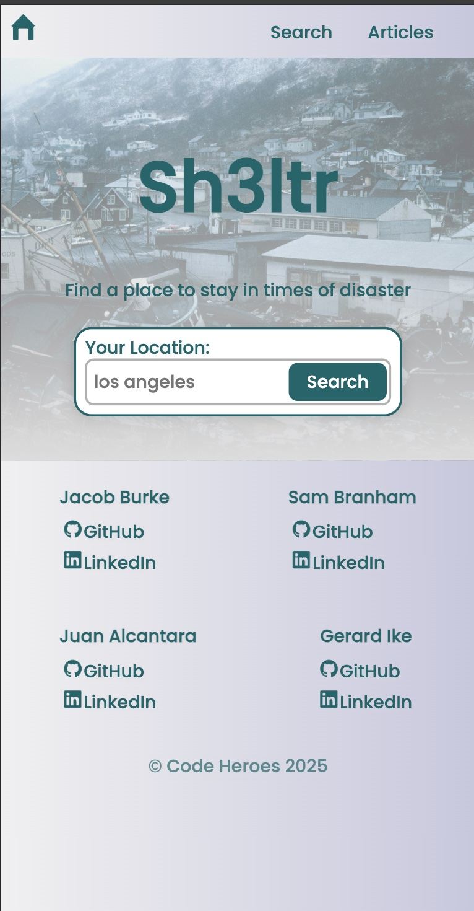
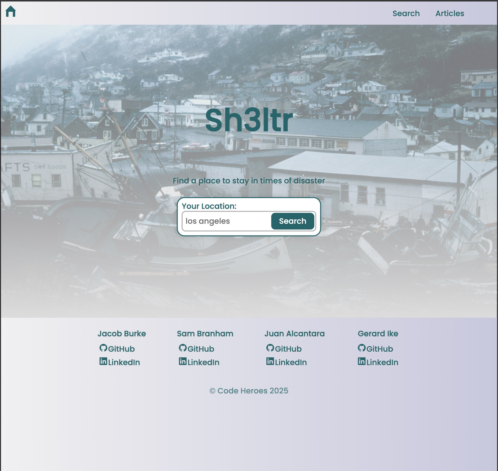
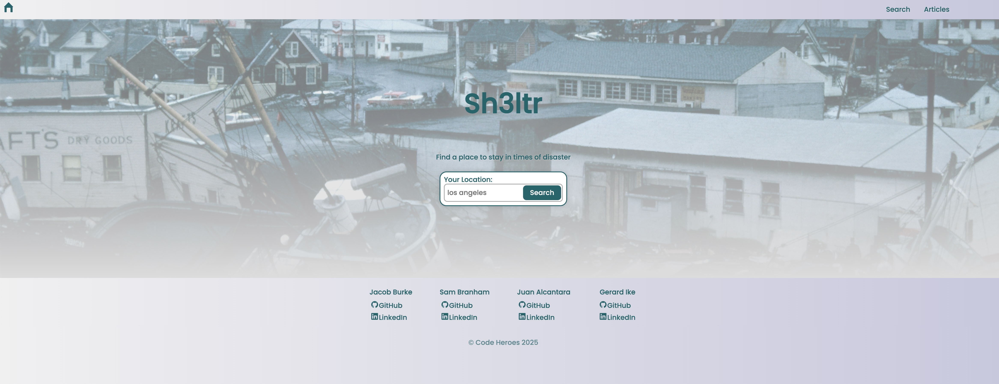

# Intro

Sh3ltr is a project to help disaster victims locate shelter when disaster happens. It was made with simple user accessability and useability in mind. The site displays the power of React + Vite, CSS and Google API's. All the elements display correctly on popular screen sizes using css grid, very minimal media queries and React. Enjoy.

# Figma

Link to project on Figma
[https://www.figma.com/design/3ottwMEhlBt95Dbn8dw1NH/Your-Final-Project?node-id=0-1&p=f&t=GvA556duA0DAeTh0-0]

# Tech Used

We used minimal media queries as mostly the responsive design is made with css display flex, React + Vite and Google places and goecoding API. Using React + Vite helps site load faster using less Bandwith, server strain and mobile performance were all taken into account when designing the site.

# Description and Functionality

Sh3ltr is a site of resources for shelter when disasters happen. Using the Google API's people can search for shelter in their city a time of need. The site is designed to function on any browser- mobile or desktop. Plans to improve the project includes adding additional resources (food, pet support etc), news, map pins, community postings.

To run site locally:

1. Open terminal and create a folder for project. Change directory to that folder.
2. Type git clone https://github.com/00H00W/CodeJamJanuary
3. Type npm install, this will create node_modules folder and package-lock.json file.
4. Type npm run dev and it will start the React development server locally on port 3000.

# Github Link

[https://github.com/00H00W/CodeJamJanuary]

# Images and Screenshots

Photo showcase of the design of the site in different dimensions for various devices. For example, for mobile devices it would look like this -

. For tablets like this

and desktops like this

The design and code were made with responsive and intuitive to users devices in mind. Easy to use, read and navigate were top priority elevating the users experience with the app.

# Video Explanation of the project

In this comprehensive video presentation, I showcase the responsive disaster shelter app project named 'Sh3ltr'. I walk through key aspects of the project, including its overview, layout and responsiveness, use of semantic HTML, implementation of the BEM methodology, CSS structure, React + Vite and personal challenges and learnings. I explain the project's intuitive design, use of CSS Flex for layout, responsive design techniques, semantic HTML implementation, and the BEM approach to the project. I also discuss our problem-solving process and the valuable skills gained throughout the project's development. This video provides insights into modern web development practices and our growth journey. Enjoy. Link to the project on Youtube []

Good luck and have fun!

## 🌐 Contact Us

### Jake Burke

**Email:** jakeburke1775@gmail.com

**Linkedin:** https://www.linkedin.com/in/jake-burke-468b13143/

**GitHub:** https://github.com/jakeburke1775

### Gerard Ike - Software Engineer

**Email:** chinedumike85@gmail.com

**Linkedin:** https://linkedin.com/in/chinedum-ike

**GitHub:** https://github.com/gerard415/

### Sam Branham - Software Engineer

**Email:** hotdogsb@gmail.com

**Linkedin:**

**GitHub:** https://github.com/00H00W

### - Juan Alcantara - Software Engineer

**Email:** 2481328@gmail.com

**Linkedin:** https://www.linkedin.com/in/juan-alcantara-9aa502301/

**GitHub:** https://github.com/jcalcan
